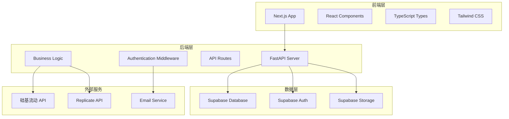

# 设计文档

## 概述

吉卜力AI图片生成平台采用现代化的全栈架构，前端使用Next.js + TypeScript构建响应式用户界面，后端使用Python + FastAPI提供高性能API服务，数据存储使用Supabase提供用户认证和数据管理，集成硅基流动和Replicate两个AI服务提供图片生成能力。

## 架构

### 系统架构图



### 技术栈

**前端:**
- Next.js 14 (App Router) - 支持SSR/SSG优化SEO
- TypeScript
- React 18
- Tailwind CSS
- Zustand (状态管理)
- React Query (数据获取)
- React Hook Form (表单处理)
- Next-SEO (SEO优化)
- Next-Sitemap (站点地图生成)
- Next-Intl (国际化支持)

**后端:**
- Python 3.11+
- FastAPI
- Pydantic (数据验证)
- SQLAlchemy (ORM)
- Alembic (数据库迁移)
- Celery + Redis (异步任务)

**数据库与认证:**
- Supabase (PostgreSQL + Auth + Storage)

**AI服务:**
- Replicate API
- 硅基流动 API

## 组件和接口

### 前端组件架构

```
src/
├── app/                    # Next.js App Router
│   ├── [locale]/          # 国际化路由
│   │   ├── (auth)/        # 认证相关页面
│   │   ├── dashboard/     # 用户仪表板
│   │   ├── gallery/       # 图片库
│   │   ├── generate/      # 图片生成
│   │   └── admin/         # 管理后台
├── components/            # 可复用组件
│   ├── ui/               # 基础UI组件
│   ├── forms/            # 表单组件
│   ├── layout/           # 布局组件
│   │   └── language-switcher.tsx  # 语言切换组件
│   └── features/         # 功能组件
├── lib/                  # 工具库
│   ├── api.ts           # API客户端
│   ├── auth.ts          # 认证逻辑
│   ├── utils.ts         # 工具函数
│   ├── validations.ts   # 表单验证
│   └── i18n.ts          # 国际化配置
├── hooks/               # 自定义Hooks
├── store/               # 状态管理
├── types/               # TypeScript类型定义
└── messages/            # 国际化文本
    ├── en.json          # 英语
    ├── zh.json          # 中文简体
    ├── ja.json          # 日语
    ├── ko.json          # 韩语
    ├── es.json          # 西班牙语
    ├── fr.json          # 法语
    ├── de.json          # 德语
    ├── it.json          # 意大利语
    ├── pt.json          # 葡萄牙语
    ├── ru.json          # 俄语
    └── ar.json          # 阿拉伯语
```

### 后端API架构

```
backend/
├── app/
│   ├── api/              # API路由
│   │   ├── auth/         # 认证相关
│   │   ├── users/        # 用户管理
│   │   ├── images/       # 图片管理
│   │   ├── generate/     # 图片生成
│   │   └── admin/        # 管理功能
│   ├── core/             # 核心配置
│   │   ├── config.py     # 应用配置
│   │   ├── security.py   # 安全相关
│   │   └── database.py   # 数据库配置
│   ├── models/           # 数据模型
│   ├── schemas/          # Pydantic模式
│   ├── services/         # 业务逻辑
│   │   ├── auth_service.py
│   │   ├── image_service.py
│   │   ├── ai_service.py
│   │   └── admin_service.py
│   └── utils/            # 工具函数
├── alembic/              # 数据库迁移
└── tests/                # 测试文件
```

## 数据模型

### 数据库表结构

**用户表 (users)**
```sql
CREATE TABLE users (
    id UUID PRIMARY KEY DEFAULT gen_random_uuid(),
    email VARCHAR(255) UNIQUE NOT NULL,
    username VARCHAR(100) UNIQUE,
    full_name VARCHAR(255),
    avatar_url TEXT,
    is_admin BOOLEAN DEFAULT FALSE,
    created_at TIMESTAMP WITH TIME ZONE DEFAULT NOW(),
    updated_at TIMESTAMP WITH TIME ZONE DEFAULT NOW()
);
```

**图片表 (images)**
```sql
CREATE TABLE images (
    id UUID PRIMARY KEY DEFAULT gen_random_uuid(),
    user_id UUID REFERENCES users(id) ON DELETE CASCADE,
    prompt TEXT NOT NULL,
    negative_prompt TEXT,
    ai_model VARCHAR(50) NOT NULL,
    image_url TEXT NOT NULL,
    thumbnail_url TEXT,
    width INTEGER,
    height INTEGER,
    generation_params JSONB,
    status VARCHAR(20) DEFAULT 'completed',
    is_public BOOLEAN DEFAULT FALSE,
    created_at TIMESTAMP WITH TIME ZONE DEFAULT NOW()
);
```

**生成任务表 (generation_tasks)**
```sql
CREATE TABLE generation_tasks (
    id UUID PRIMARY KEY DEFAULT gen_random_uuid(),
    user_id UUID REFERENCES users(id) ON DELETE CASCADE,
    prompt TEXT NOT NULL,
    ai_model VARCHAR(50) NOT NULL,
    status VARCHAR(20) DEFAULT 'pending',
    external_task_id VARCHAR(255),
    result_url TEXT,
    error_message TEXT,
    created_at TIMESTAMP WITH TIME ZONE DEFAULT NOW(),
    completed_at TIMESTAMP WITH TIME ZONE
);
```

### API接口设计

**认证接口**
- `POST /api/auth/register` - 用户注册
- `POST /api/auth/login` - 用户登录
- `POST /api/auth/logout` - 用户登出
- `POST /api/auth/refresh` - 刷新令牌
- `POST /api/auth/forgot-password` - 忘记密码
- `POST /api/auth/reset-password` - 重置密码

**图片生成接口**
- `POST /api/generate` - 创建生成任务
- `GET /api/generate/{task_id}` - 查询任务状态
- `GET /api/generate/models` - 获取可用模型

**图片管理接口**
- `GET /api/images` - 获取用户图片列表
- `GET /api/images/{image_id}` - 获取图片详情
- `DELETE /api/images/{image_id}` - 删除图片
- `PUT /api/images/{image_id}` - 更新图片信息
- `POST /api/images/{image_id}/share` - 分享图片

**用户管理接口**
- `GET /api/users/profile` - 获取用户资料
- `PUT /api/users/profile` - 更新用户资料
- `GET /api/users/stats` - 获取用户统计

**管理员接口**
- `GET /api/admin/users` - 用户列表
- `GET /api/admin/stats` - 系统统计
- `GET /api/admin/logs` - 系统日志

## 错误处理

### 错误分类和处理策略

**客户端错误 (4xx)**
- 400 Bad Request: 请求参数错误
- 401 Unauthorized: 未认证
- 403 Forbidden: 权限不足
- 404 Not Found: 资源不存在
- 422 Unprocessable Entity: 数据验证失败

**服务器错误 (5xx)**
- 500 Internal Server Error: 服务器内部错误
- 502 Bad Gateway: 外部服务错误
- 503 Service Unavailable: 服务不可用

**AI服务错误处理**
- API限制: 实施队列和重试机制
- 服务不可用: 自动切换到备用服务
- 生成失败: 提供详细错误信息和重试选项

### 重试和降级策略

```python
# 重试配置
RETRY_CONFIG = {
    "max_attempts": 3,
    "backoff_factor": 2,
    "timeout": 30
}

# 降级策略
FALLBACK_STRATEGY = {
    "siliconflow_unavailable": "switch_to_replicate",
    "replicate_unavailable": "queue_for_later",
    "both_unavailable": "notify_user"
}
```

## 测试策略

### 测试层级

**单元测试**
- 业务逻辑函数测试
- 数据模型验证测试
- API端点测试
- 前端组件测试

**集成测试**
- 数据库操作测试
- 外部API集成测试
- 认证流程测试

**端到端测试**
- 用户注册登录流程
- 图片生成完整流程
- 图片管理操作流程

### 测试工具

**后端测试**
- pytest (测试框架)
- pytest-asyncio (异步测试)
- httpx (HTTP客户端测试)
- factory-boy (测试数据生成)

**前端测试**
- Jest (单元测试)
- React Testing Library (组件测试)
- Playwright (端到端测试)

### 性能和监控

**性能优化**
- 图片CDN加速
- API响应缓存
- 数据库查询优化
- 前端代码分割和懒加载

**监控指标**
- API响应时间
- 数据库查询性能
- AI服务调用成功率
- 用户活跃度统计
- 错误率和异常监控

**日志记录**
- 结构化日志格式
- 不同级别的日志记录
- 敏感信息脱敏
- 日志聚合和分析

## SEO优化策略

### 技术SEO

**页面性能优化**
- Core Web Vitals优化 (LCP < 2.5s, FID < 100ms, CLS < 0.1)
- 图片懒加载和WebP格式优化
- 代码分割和预加载关键资源
- 服务端渲染(SSR)和静态生成(SSG)
- CDN加速和缓存策略

**移动端优化**
- 响应式设计确保移动友好
- 触摸友好的交互元素
- 快速的移动端加载速度
- AMP页面支持(可选)

**网站结构**
- 清晰的URL结构 (/gallery/[id], /generate, /profile)
- 面包屑导航
- 内部链接优化
- XML站点地图自动生成
- Robots.txt配置

### 内容SEO

**页面元数据**
```typescript
// SEO配置示例
const seoConfig = {
  title: "吉卜力AI图片生成器 - 免费在线AI艺术创作平台",
  description: "使用AI技术生成精美的吉卜力风格图片，支持多种AI模型，免费在线创作属于你的艺术作品",
  keywords: "AI图片生成,吉卜力风格,人工智能艺术,免费AI工具,图片创作",
  openGraph: {
    title: "吉卜力AI图片生成器",
    description: "免费AI图片生成平台，创作吉卜力风格艺术作品",
    images: ["/og-image.jpg"],
    type: "website"
  },
  twitter: {
    card: "summary_large_image",
    title: "吉卜力AI图片生成器",
    description: "免费AI图片生成平台"
  }
}
```

**内容策略**
- 图片详情页面包含丰富的描述和标签
- 用户生成内容的SEO优化
- 相关图片推荐增加页面停留时间
- 定期更新的博客/教程内容
- 多语言支持(中英文)

**结构化数据**
```json
{
  "@context": "https://schema.org",
  "@type": "WebApplication",
  "name": "吉卜力AI图片生成器",
  "description": "AI驱动的图片生成平台",
  "applicationCategory": "MultimediaApplication",
  "operatingSystem": "Web Browser",
  "offers": {
    "@type": "Offer",
    "price": "0",
    "priceCurrency": "CNY"
  }
}
```

### 页面级SEO实现

**首页优化**
- 主要关键词: "AI图片生成", "吉卜力风格", "免费AI工具"
- 清晰的价值主张和功能介绍
- 用户作品展示增加视觉吸引力
- 快速生成演示提高转化率

**图片库页面**
- 每个图片独立URL和元数据
- 图片alt标签包含描述性文本
- 社交分享优化
- 相关图片推荐

**用户资料页面**
- 公开用户作品集
- 用户简介和创作历史
- 社交媒体链接

### 本地SEO(如适用)

**Google My Business**
- 如有实体业务，设置GMB页面
- 定期更新业务信息
- 收集和回复用户评价

### 内容营销SEO

**博客内容策略**
- AI艺术创作教程
- 吉卜力风格解析
- 用户作品特色
- 行业趋势分析
- 工具使用指南

**关键词策略**
- 主要关键词: AI图片生成、人工智能艺术、吉卜力风格
- 长尾关键词: 免费AI图片生成器、在线AI艺术创作、吉卜力风格图片制作
- 本地化关键词: 中文AI工具、国产AI平台

### 链接建设策略

**内部链接**
- 相关图片和用户推荐
- 分类和标签页面
- 教程和帮助文档链接

**外部链接获取**
- 与AI/设计博客合作
- 社交媒体推广
- 用户生成内容分享
- 行业论坛参与

### SEO监控和分析

**关键指标**
- 有机搜索流量
- 关键词排名
- 页面加载速度
- 用户行为指标(跳出率、停留时间)
- 转化率(注册、生成图片)

**工具配置**
- Google Analytics 
- Google Search Console
- 第三方SEO工具(Semrush/Ahrefs)

**定期优化任务**
- 月度SEO报告
- 关键词排名监控
- 技术SEO审计
- 内容性能分析
- 竞争对手分析

## 多语言国际化设计

### 支持的语言列表

平台将支持11种常用国家语言，通过URL路径进行语言切换：

1. **en** - English (英语) - 默认语言
2. **zh** - 中文简体 (Simplified Chinese)
3. **ja** - 日本語 (Japanese)
4. **ko** - 한국어 (Korean)
5. **es** - Español (Spanish)
6. **fr** - Français (French)
7. **de** - Deutsch (German)
8. **it** - Italiano (Italian)
9. **pt** - Português (Portuguese)
10. **ru** - Русский (Russian)
11. **ar** - العربية (Arabic)

### URL结构设计

```
# 语言路径结构
/{locale}/                    # 首页
/{locale}/generate           # 图片生成页面
/{locale}/gallery            # 图片库
/{locale}/dashboard          # 用户仪表板
/{locale}/login              # 登录页面
/{locale}/register           # 注册页面

# 示例URL
/en/generate                 # 英语生成页面
/zh/generate                 # 中文生成页面
/ja/generate                 # 日语生成页面
```

### 语言切换组件设计

**导航栏语言切换器**
```typescript
// components/layout/language-switcher.tsx
interface LanguageSwitcherProps {
  position: 'navbar' | 'footer';
  variant: 'dropdown' | 'inline';
}

const languages = [
  { code: 'en', name: 'English', flag: '🇺🇸' },
  { code: 'zh', name: '中文', flag: '🇨🇳' },
  { code: 'ja', name: '日本語', flag: '🇯🇵' },
  { code: 'ko', name: '한국어', flag: '🇰🇷' },
  { code: 'es', name: 'Español', flag: '🇪🇸' },
  { code: 'fr', name: 'Français', flag: '🇫🇷' },
  { code: 'de', name: 'Deutsch', flag: '🇩🇪' },
  { code: 'it', name: 'Italiano', flag: '🇮🇹' },
  { code: 'pt', name: 'Português', flag: '🇵🇹' },
  { code: 'ru', name: 'Русский', flag: '🇷🇺' },
  { code: 'ar', name: 'العربية', flag: '🇸🇦' }
];
```

**布局位置**
- **导航栏**: 右上角下拉菜单形式
- **底部**: 页脚区域内联形式
- **移动端**: 汉堡菜单内集成

### 国际化配置

**Next.js国际化配置**
```typescript
// next.config.js
const nextConfig = {
  i18n: {
    locales: ['en', 'zh', 'ja', 'ko', 'es', 'fr', 'de', 'it', 'pt', 'ru', 'ar'],
    defaultLocale: 'en',
    localeDetection: true,
  },
  // 支持RTL语言
  experimental: {
    scrollRestoration: true,
  }
}
```

**国际化文本结构**
```json
// messages/en.json
{
  "common": {
    "loading": "Loading...",
    "error": "Error",
    "success": "Success",
    "cancel": "Cancel",
    "confirm": "Confirm",
    "save": "Save"
  },
  "navigation": {
    "home": "Home",
    "generate": "Generate",
    "gallery": "Gallery",
    "dashboard": "Dashboard",
    "login": "Login",
    "register": "Register"
  },
  "generate": {
    "title": "AI Image Generator",
    "prompt_placeholder": "Enter your prompt here...",
    "negative_prompt": "Negative prompt (optional)",
    "select_model": "Select AI Model",
    "generate_button": "Generate Image",
    "generating": "Generating your image..."
  },
  "seo": {
    "home_title": "Ghibli AI Image Generator - Free Online AI Art Creation Platform",
    "home_description": "Create beautiful Ghibli-style images using AI technology. Support multiple AI models for free online art creation.",
    "generate_title": "Generate AI Images - Ghibli Style Art Creator",
    "gallery_title": "AI Art Gallery - Browse Generated Images"
  }
}
```

### RTL语言支持

**阿拉伯语RTL布局**
```css
/* globals.css */
[dir="rtl"] {
  direction: rtl;
  text-align: right;
}

[dir="rtl"] .flex-row {
  flex-direction: row-reverse;
}

[dir="rtl"] .ml-4 {
  margin-left: 0;
  margin-right: 1rem;
}
```

### SEO多语言优化

**每种语言的SEO配置**
```typescript
// lib/seo-config.ts
export const getSEOConfig = (locale: string) => {
  const configs = {
    en: {
      title: "Ghibli AI Image Generator - Free Online AI Art Creation",
      description: "Create beautiful Ghibli-style images using AI technology...",
      keywords: "AI image generator, Ghibli style, artificial intelligence art"
    },
    zh: {
      title: "吉卜力AI图片生成器 - 免费在线AI艺术创作平台",
      description: "使用AI技术生成精美的吉卜力风格图片...",
      keywords: "AI图片生成,吉卜力风格,人工智能艺术"
    },
    ja: {
      title: "ジブリAI画像ジェネレーター - 無料オンラインAIアート作成",
      description: "AI技術を使用して美しいジブリスタイルの画像を作成...",
      keywords: "AI画像生成,ジブリスタイル,人工知能アート"
    }
    // ... 其他语言配置
  };
  
  return configs[locale] || configs.en;
};
```

**多语言站点地图**
```xml
<!-- 自动生成多语言站点地图 -->
<urlset xmlns="http://www.sitemaps.org/schemas/sitemap/0.9"
        xmlns:xhtml="http://www.w3.org/1999/xhtml">
  <url>
    <loc>https://example.com/en/</loc>
    <xhtml:link rel="alternate" hreflang="zh" href="https://example.com/zh/"/>
    <xhtml:link rel="alternate" hreflang="ja" href="https://example.com/ja/"/>
    <!-- 其他语言链接 -->
  </url>
</urlset>
```

### 用户体验设计

**语言检测和切换**
- 自动检测用户浏览器语言
- 记住用户语言偏好(localStorage)
- 平滑的语言切换动画
- 保持当前页面路径切换语言

**内容本地化**
- 日期时间格式本地化
- 数字和货币格式
- 图片和图标的文化适应
- 颜色和设计的文化考虑

**性能优化**
- 按需加载语言包
- 语言包缓存策略
- 服务端渲染多语言支持
- CDN分发不同语言版本